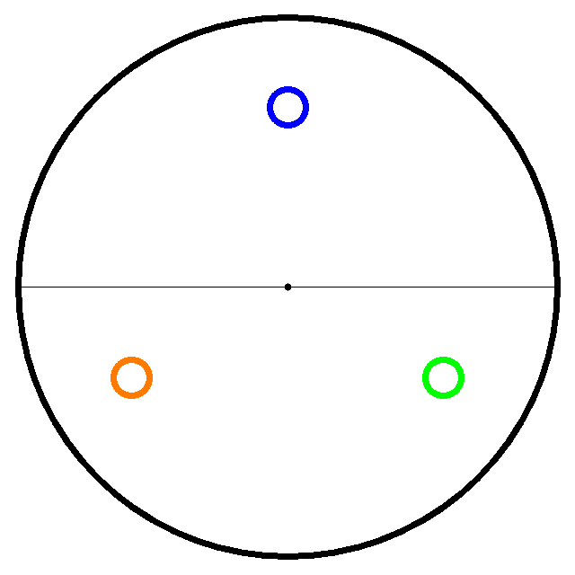
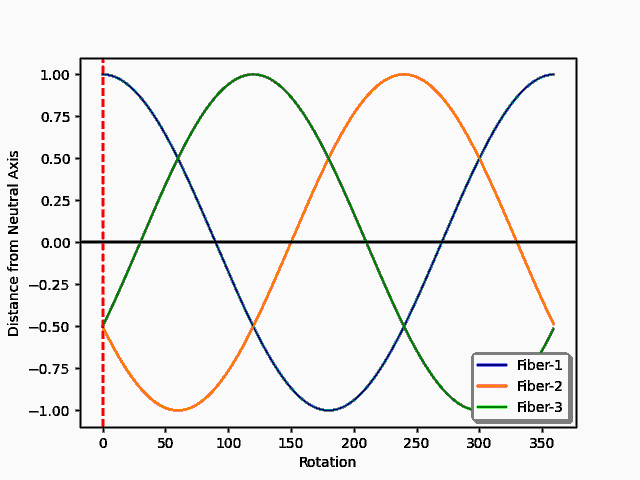
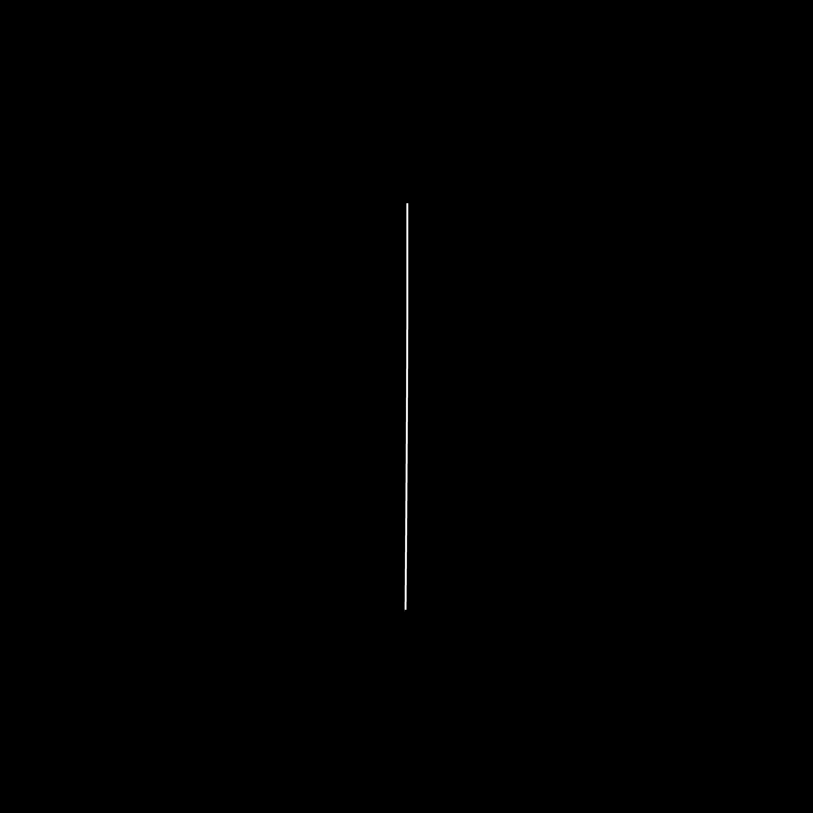
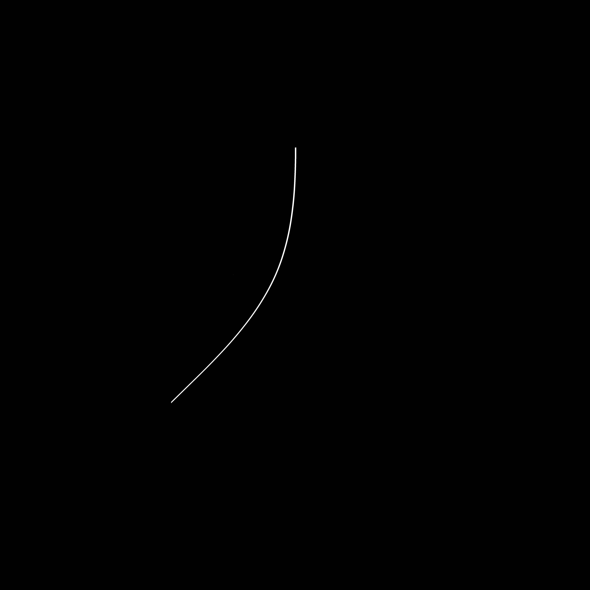

# Tether Shape Monitoring with Fiber Bragg Gratings
  This senior design project, through the UCONN Materials Science and Engineering Department and General Dynamics Electric Boat, was concerned with providing simulations and mathematical models that explore the viability of predicting the shape of UUV tethers via the use of fiber optic cables with Bragg Grating Sensors to directly monitor strain values through reflected optical signals. By using ANSYS Mechanical APDL, three “fibers” are oriented into several different cross-sectional layouts and are deformed with strain being measured at certain censor locations. Data is then passed into two mathematical models which leverage the cross-sectional layout of the fibers and the strain experienced to recreate the tether shape. Thank you to Dr. Charles Jewart of General Dynamics Electric Boat for the aid over the past year and the opportunity to work on this project, as well as Dr. Serge Nakhmanson of the University of Connecticut for his invaluable guidance and patience throughout this unprecedented remote learning project.  

####    Rotating Cross Section of Tether with 3 fibers

####    Distance from neutral axis for each fiber as tether is rotated  

# Repository Breakdown:

 

## ./Ansys/
####    Three files to be run sequentially in order to render the tether in ANSYS with desired stress and layout (Three point bend), returning strain values and displacement 

**1_2D_Cross_Section_write.txt-**
    Create cross sectional layout. Decide location of fibers as well as fiber and tether diameter  
**2_csec_nodes.txt-**
    Create tether as beam element using previously generated cross section from part-1  
**3_3_point_Bending.txt-**
    Apply bending forces to the beam generated in part-2, returns the displacement and strain values  

 

## ./Ansys_Results/
####    Stores the results from test run for Paper

**Bending/**    Bend testing with various forces, constant layout 
**Rotation/**   Bend testing with various layout orientations, constant force applied

 

## ./Renders/
####     Stores results from python drivers

**Bending/**    Render outputs from driver on bending force data  
**Rotated/**    Render outputs from driver on rotation data

 

## ./
####    Root Contains all python drivers and files neccesary to run them

### Drivers:

**parsed_bending_driver.py**
    Parses bending data from /Ansys_Results/Bending/ and renders an output for each trail  
**parsed_rotation_driver.py**
    Parses bending data from /Ansys_Results/Rotated/ and renders an output for each trial  
*Renderings are at 1/10th scale and were subsequently measured using ImageJ*  

**generate_wavelength.py**
    Parses Ansys data from Ansys_Results/bending/ and Ansys_Results/rotated/, printing the wavelength shift for each trial  

 

### Drivers rely on the following files, containing function definitions

**parser.py**
    Functions to parse data from  /Ansys_Results/  
**calculate_rotation.py**
    Functions to calculate rotation direction based on strain values  
**graph_rotation.py** 
    Function graphs distance from neutral axis vs rotation for 3 fiber model as gif, syncs with points_to_diagram output  
**points_to_diagram.py** 
    Functions for rendering a sample cross section layout for the fiber relative to neutral axis, given any theta value, outputs multiple thetas as gif  
**strain_to_curve.py**
    Function which converts strain and rotation direction to tether bend rate.   
**render_shape.py**
    Functions to take bend direction and bend rate for each segment, interpolate, and render 2D output 

####    Render with 0N of Force

####    Render with 200N of Force

